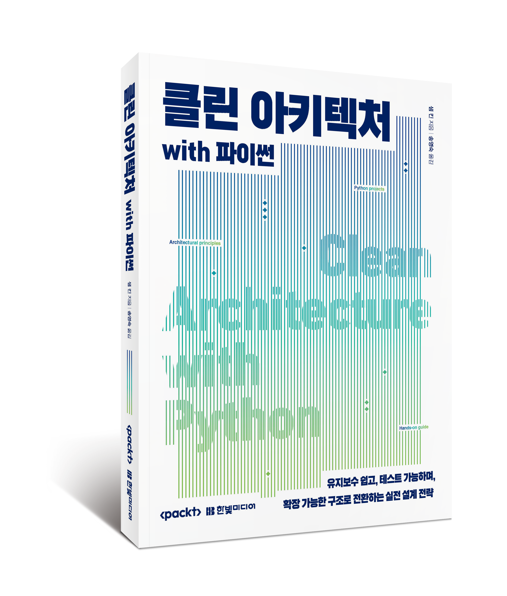
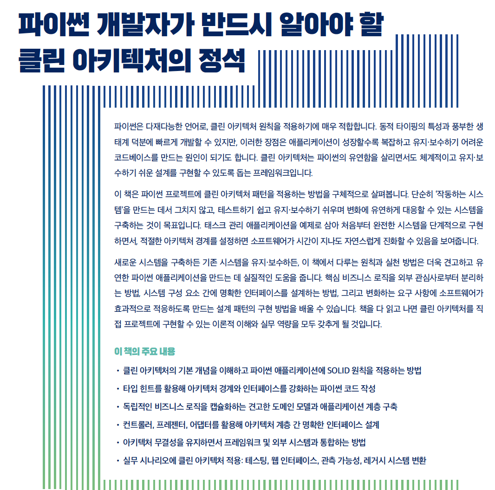

<h1 align="center">
파이썬으로 구현하는 클린 아키텍처, 초판</h1>

<p align="center">
  
</p>

<p align="center">이 저장소는 Packt에서 출판한 <a href ="https://www.packtpub.com/en-us/product/clean-architecture-with-python-9781836642893">파이썬으로 구현하는 클린 아키텍처, 초판</a>의 코드 번역본 저장소입니다.
</p>

<details open>
  <summary><h2>이 책에 대하여</summary>

<p align="center">
  
</p>

</details>
<details open>
  <summary><h2>코드 예제 노트북 (Google Colab)</summary>

| 장 | 제목 | Colab |
|:---:|------|:---:|
| 01 | 클린 아키텍처의 핵심: 파이썬 개발의 변화 | [](https://colab.research.google.com/github/songys/Clean-Architecture-with-Python/blob/main/Chapter_1/Chapter_1_%EC%BD%94%EB%93%9C%EC%98%88%EC%A0%9C.ipynb) |
| 02 | SOLID 기초: 견고한 파이썬 애플리케이션 구축 | [](https://colab.research.google.com/github/songys/Clean-Architecture-with-Python/blob/main/Chapter_2/Chapter_2_%EC%BD%94%EB%93%9C%EC%98%88%EC%A0%9C.ipynb) |
| 03 | 파이썬의 타입 강화: 클린 아키텍처 견고하게 만들기 | [](https://colab.research.google.com/github/songys/Clean-Architecture-with-Python/blob/main/Chapter_3/Chapter_3_%EC%BD%94%EB%93%9C%EC%98%88%EC%A0%9C.ipynb) |
| 04 | 도메인 주도 설계: 핵심 비즈니스 로직 설계 | [](https://colab.research.google.com/github/songys/Clean-Architecture-with-Python/blob/main/Chapter_4/Chapter_4_%EC%BD%94%EB%93%9C%EC%98%88%EC%A0%9C.ipynb) |
| 05 | 애플리케이션 계층: 유스 케이스에서의 조율 | [](https://colab.research.google.com/github/songys/Clean-Architecture-with-Python/blob/main/Chapter_5/Chapter_5_%EC%BD%94%EB%93%9C%EC%98%88%EC%A0%9C.ipynb) |
| 06 | 인터페이스 어댑터 계층: 컨트롤러와 프레젠터 | [](https://colab.research.google.com/github/songys/Clean-Architecture-with-Python/blob/main/Chapter_6/Chapter_6_%EC%BD%94%EB%93%9C%EC%98%88%EC%A0%9C.ipynb) |
| 07 | 프레임워크 및 드라이버 계층: 외부 인터페이스 | [](https://colab.research.google.com/github/songys/Clean-Architecture-with-Python/blob/main/Chapter_7/Chapter_7_%EC%BD%94%EB%93%9C%EC%98%88%EC%A0%9C.ipynb) |
| 08 | 클린 아키텍처로 구현하는 테스트 패턴 | [](https://colab.research.google.com/github/songys/Clean-Architecture-with-Python/blob/main/Chapter_8/Chapter_8_%EC%BD%94%EB%93%9C%EC%98%88%EC%A0%9C.ipynb) |
| 09 | 웹 UI 추가: 클린 아키텍처의 인터페이스 유연성 | [](https://colab.research.google.com/github/songys/Clean-Architecture-with-Python/blob/main/Chapter_9/Chapter_9_%EC%BD%94%EB%93%9C%EC%98%88%EC%A0%9C.ipynb) |
| 10 | 관측 가능성 구현: 모니터링과 검증 | [](https://colab.research.google.com/github/songys/Clean-Architecture-with-Python/blob/main/Chapter_10/Chapter_10_%EC%BD%94%EB%93%9C%EC%98%88%EC%A0%9C.ipynb) |
| 11 | 레거시에서 클린으로: 유지 보수를 위한 파이썬 리팩터링 | [](https://colab.research.google.com/github/songys/Clean-Architecture-with-Python/blob/main/Chapter_11/Chapter_11_%EC%BD%94%EB%93%9C%EC%98%88%EC%A0%9C.ipynb) |
| 12 | 클린 아키텍처를 향한 여정: 다음 단계 | [](https://colab.research.google.com/github/songys/Clean-Architecture-with-Python/blob/main/Chapter_12/Chapter_12_%EC%BD%94%EB%93%9C%EC%98%88%EC%A0%9C.ipynb) |

</details>


<details open>
  <summary><h2>발표자료 (Google Drive)</summary>

장별 발표자료(PPTX)는 아래 Google Drive에서 내려받을 수 있다.

👉 [발표자료 전체 보기](https://drive.google.com/drive/folders/1dLUfqM8iej12E21myhra4HJGdtwJdLsw?usp=sharing)

</details>


<details>
  <summary>📚 도서 판매처</summary>

  <ul>
    <li><a href="https://www.yes24.com/product/goods/188253761">예스24</a></li>
    <li><a href="https://www.aladin.co.kr/shop/wproduct.aspx?ItemId=391560607">알라딘</a></li>
    <li><a href="https://product.kyobobook.co.kr/detail/S000219800943">교보문고</a></li>
  </ul>
</details>


<details open>
  <summary><h2>프로젝트 구조</summary>
코드는 장별로 구성되어 있다. 각 `Chapter_X` 폴더(예: `Chapter_1`, `Chapter_2`)는 해당 장이 끝난 시점의 애플리케이션 상태를 보여주는 스냅샷이다.

장 폴더의 구조 예시는 다음과 같다:
- `README.md`: 해당 장의 애플리케이션 실행 또는 테스트 실행 방법이 담겨 있다.
- `Chapter_N_코드예제.ipynb`: 해당 장의 주요 코드 예제를 실행 가능한 주피터 노트북으로 묶은 파일이다. Colab에서 바로 열어 실습할 수 있다.
- `chapter_code_excerpts`: 해당 장에 등장하는 코드 조각이 파일 등장 순서에 따라 숫자 인덱스와 함께 저장되어 있다(예: `00_error_class.py`). 참조용으로 제공되며 실행을 목적으로 하지 않는다.
- `TodoApp`: 해당 장의 동반 애플리케이션 코드가 들어 있다(해당되는 경우). 이 코드는 해당 장의 구현 범위 내에서 실행 가능하다. 장에 따라 구현된 계층이 다르며, 예를 들어 4장은 도메인 계층만, 7장 이후는 네 계층이 모두 포함된다.

```
Chapter_7/
├── README.md
├── Chapter_7_코드예제.ipynb
│
├── chapter_code_excerpts
│   ├── 00_repository_pattern.py
│   ├── 01_file_repository.py
│   ├── ...
│
└── TodoApp
    └── todo_app
        ├── application
        ├── domain
        ├── infrastructure
        └── interfaces
```
모든 코드는 MacOS와 Windows에서 Python 3.13으로 테스트 및 검증되었다. 파이썬의 특성상 Python 런타임을 지원하는 다른 플랫폼에서도 작동할 것으로 예상되지만, 이는 검증되지 않았다.

  </details>
<details open>
  <summary><h2>1. 의존성 설치</summary>

  ### 의존성 관리

설정을 간소화하기 위해 이 저장소는 루트에 위치한 하나의 `pyproject.toml` 파일을 사용한다. 이 파일은 *전체* 프로젝트의 의존성을 정의하며, 모든 장에 필요한 패키지의 합집합을 효과적으로 설치한다.

의존성 관리에는 [UV](https://docs.astral.sh/uv/)를 사용한다. `pip`을 단독으로 사용하려는 사용자를 위해 `requirements.txt` 파일도 제공된다.

### UV로 의존성 설치
`uv`가 설치되어 있다면 다음과 같이 환경을 생성할 수 있다:

```shell
# 가상 환경 생성
> uv venv

# 환경 활성화
# macOS/Linux:
> source .venv/bin/activate
# Windows:
> .venv\Scripts\activate
```

가상 환경을 활성화한 후, 다음 방법 중 하나로 필요한 패키지를 설치한다:

```shell
# uv와 pyproject.toml을 사용하여 의존성 동기화
> uv sync
```

### `pip`으로 의존성 설치

**가상 환경 생성:**

```shell
# 가상 환경 생성
> python -m venv .venv

# 환경 활성화
# macOS/Linux:
> source .venv/bin/activate
# Windows:
> .venv\Scripts\activate
```

**`pip install` 실행:**

```shell
# pip 최신 버전으로 업데이트
> python -m pip install --upgrade pip

# pip으로 의존성 설치
> pip install -r requirements.txt
```
  </details>
<details open>
  <summary><h2>2. 장별 코드 탐색 및 실행</summary>
관심 있는 장의 폴더로 이동한다. 각 장에는 해당 장의 애플리케이션 실행 또는 테스트 실행 방법이 담긴 `README.md` 파일이 있다.

**예시: 5장 테스트 실행**

```shell
# 해당 장의 애플리케이션 폴더로 이동
> cd Chapter_5/TodoApp

# 테스트 실행 (예시 명령어, 장마다 다를 수 있음)
> pytest
```
  </details>

<details>
  <summary><h2>저자 소개</h2></summary>

_샘 킨(Sam Keen)_ 은 25년 이상의 경력을 보유한 소프트웨어 엔지니어링 리더다. 다양한 프로그래밍 언어를 다루는 개발자로, 소규모 스타트업부터 AWS, 룰루레몬(Lululemon), 나이키(Nike) 같은 업계 거대 기업에 이르기까지 다양한 환경에서 파이썬을 활용해 왔다. 전문 분야는 클라우드 아키텍처, 지속적 배포, 확장 가능한 시스템 구축에 걸쳐 있다. 룰루레몬에서 샘은 회사 최초의 클라우드 네이티브 애플리케이션 개발팀을 개척하여 사내 분산 클라우드 아키텍처의 표준을 확립했다. 현재 AWS에서 클린 아키텍처 원칙과 유지 보수 가능한 코드에 중점을 두고 내부 플랫폼 엔지니어링 솔루션을 설계하고 구현하는 데 파이썬을 활용하고 있다. 사랑하는 아내와 두 마리의 고양이와 함께 미국 태평양 북서부에 거주하고 있다.

</details>
<details>
  <summary><h2>관련 도서</h2></summary>
<ul>

  <li><a href="https://www.packtpub.com/en-us/product/learn-python-programming-9781835882948">Learn Python Programming, Fourth Edition</a></li>

  <li><a href="https://www.packtpub.com/en-us/product/clean-code-in-python-9781800560215">Clean Code in Python, Second Edition</a></li>

  <li><a href="https://www.packtpub.com/en-us/product/python-object-oriented-programming-9781801077262">Python Object-Oriented Programming, Fourth Edition</a></li>

</ul>

</details>
